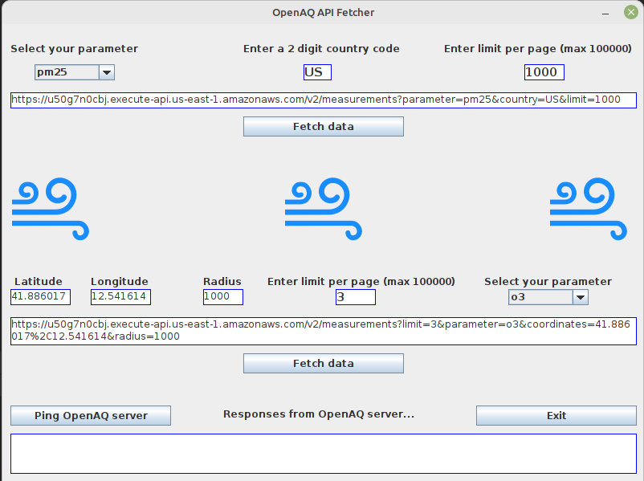
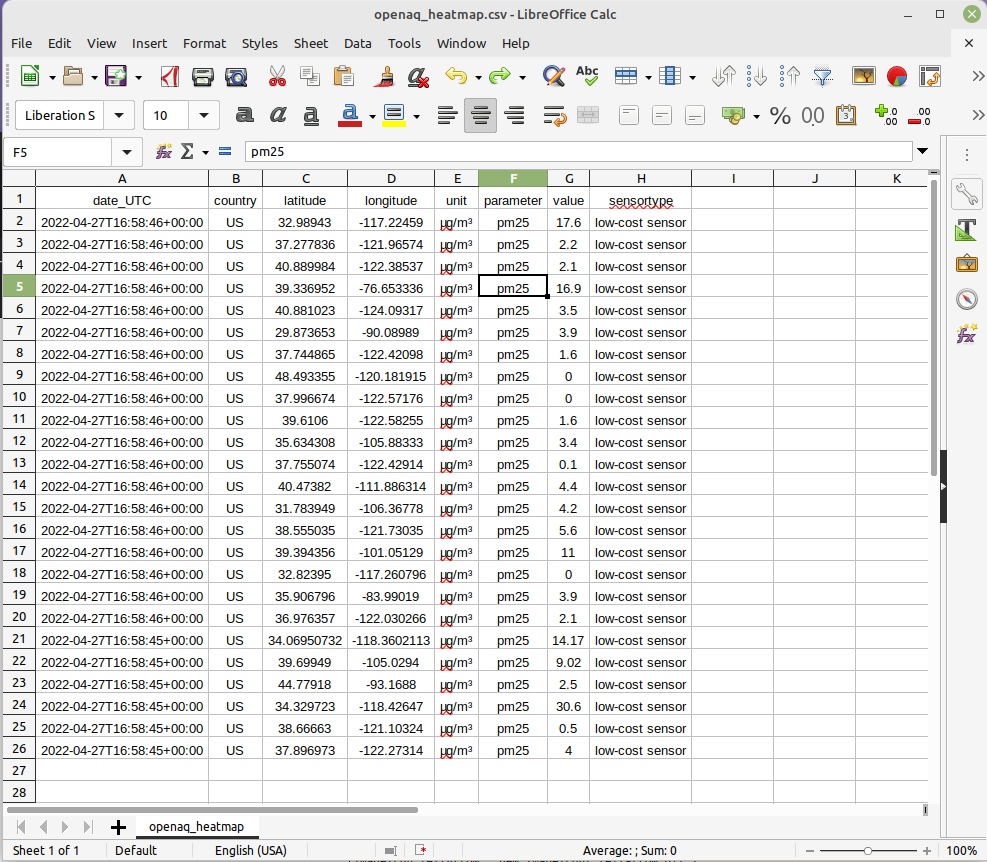

# Back-End / Java Take-Home Assessment
<div style="text-align: center;"><br></div>

## Table of contents
* [Overview](#overview) 
* [Scope](#scope)
* [Setup](#setup)
* [Usage](#usage)
* [Output](#output)


## Overview
Simple Java app created using the Java Swing framework for the graphical user interface. This application consumes 
data via an API endpoint url using the JSON format from OpenAQ.org and converts that data to a CSV format. 
This CSV can then be used by a front-end developer for a consumption into a heat map visualization.

## Scope
Use the OpenAQ-provided API to create a component that provides a heatmap of air quality data in your home country!

OpenAQ (https://openaq.org/) is a free resource that provides, via an OpenAPI specification 
(https://docs.openaq.org/#/), data points on air quality. 

Build a Java component that takes input and returns a data structure that can be consumed by a front-end team to build 
a Heat Map visualization of air quality in the given region. Your component should be able to handle the following 
inputs:

```Two-letter “Country Code” and Measured Parameter (pm25, co, no2, etc.)```

```Decimal-Degree Coordinates & Radius and Measured Parameter (pm25, co, no2, etc.)```

Based on the provided input, your component should be able to hit the live OpenAQ API and return a data structure 
that represents all the elements to construct a visual representation of the data in the form of a heatmap. You will 
likely need to interact with the locations endpoint and / or the measurements' endpoint (note that these are the v2 
endpoints that we should use… please avoid the v1 endpoints). Importantly, your code should return enough information 
to construct a color scale, and lay out the data on the map for the requested Measure Parameter. 


## Setup
Requires json simple 1.1.1

## Usage
If you wish to execute the stand-alone JAR file, you can download it [HERE.](https://github.com/CorpHackRyan/oracle-take-home/blob/master/out/artifacts/oracle_take_home_jar/oracle-take-home.jar)
The artifact was built using OpenJDK 18 with language level 11.<br><br>
You can watch a live demonstration screen recording of the application in real time [HERE.](/assets/demonstration.mkv)<br><br>
The application is broken into two sections - top and bottom. In the top section, you select your parameter, enter in 
your 2 digit country code and the total amount of entries to retrieve in the limit per page text box. 
The bottom section allows you to get a little more granular with your requests, and allows for longitudinal and 
latitudinal coordinates and a radius. Same as  above, you enter in your total amount of entries to retrieve and 
the parameter you wish to retrieve.<br><br>
The fetch data buttons will access its respective inputs (either top or bottom) and if successful, return all values 
and export them to a local CSV file called "openaq_heatmap.csv". It will be exported to the root directory of the 
application.<br><br>
The textbox which contains the API URL is filled in by default for a quick hit.  <br><br>
The Ping OpenAQ server button will just ping the server to  verify it is up and working, and will respond with a status 
in the status box below it. 


## Output
The main user interface<br>
<br>
The resulting CSV export file from the API requests<br>
<br>